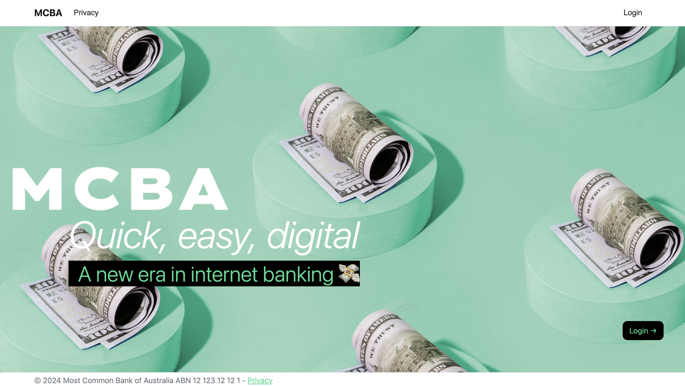
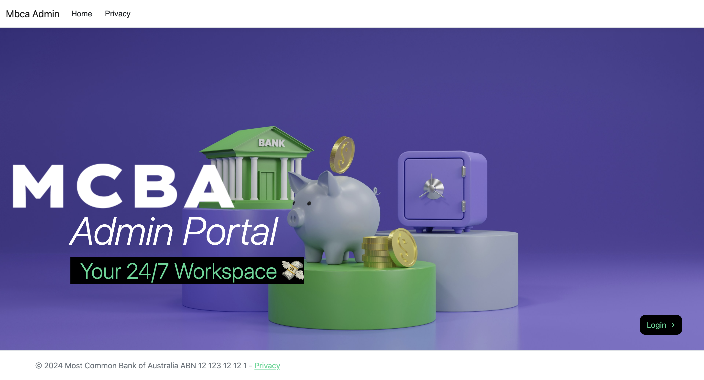

# 🙋‍♀️ Authors: s3959666-s3961136-a2
Group 9
- s3961136 Benjaporn Wongmayura
- s3959666 Xiaohan Qin
- [GitHub Repository for Assignment 2: [https://github.com/rmit-wdt-summer-2024/s3959666-s3961136-a2](https://github.com/rmit-wdt-summer-2024/s3959666-s3961136-a2)]

# 💸 MCBA (Most Common Bank of Australia)

  <h3>Client Website</h3>
  
  
    
  <h3>Admin Portal Website</h3>
  

## 🔗 Table of Contents
1. [About the Project](#about-the-project)
2. [Technology Stack](#technology-stack)
3. [Trello Board Screenshots](#trello-board-screenshots)

## 🔭 About the Project
The internet banking web application is designed to offer comprehensive banking services through a user-friendly web interface. It enables customers to execute a range of banking transactions such as depositing funds, withdrawing money, transferring funds between accounts, reviewing their account statements, and securely logging out.

## 🛠 Technology Stack
- 
- 
- 
- 

### 📋 Trello Board Screenshots

  
  
  
  
  
  
  
  
  
  

